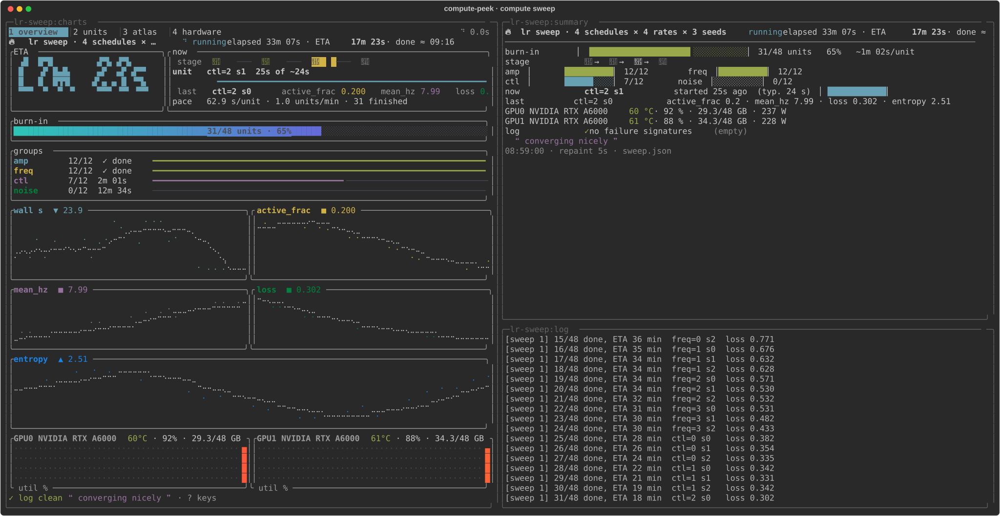
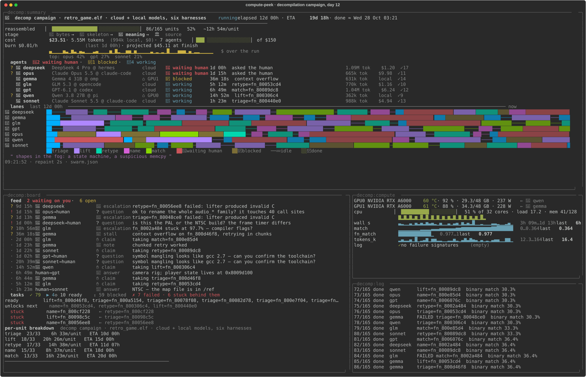
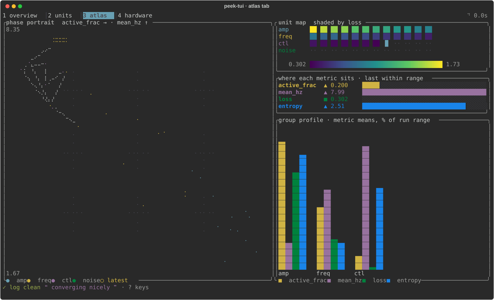
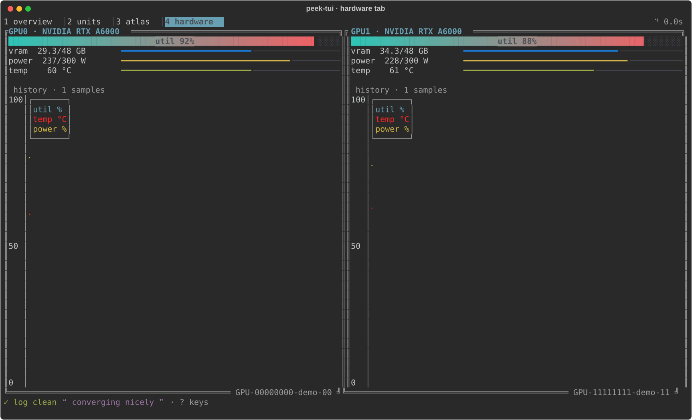

# compute-peek

A live window into a long run: a GPU sweep that takes an afternoon, or a swarm of agents
working a campaign for three weeks. The run appends events to a JSONL file. A small JSON
**peek-spec** says which panes to open and what each one shows. `launch` builds that window
in **tmux** or **herdr**, and running it again changes nothing.





*Real renders, not mockups: `python3 docs/capture.py` regenerates every image from the
synthetic demo runs.*

## Why

A log that scrolls by tells you nothing at a glance. Each window is ordered by what you
need to know first:

> **Is anything on fire, or waiting on me?** → how long is left → what's running →
> per-group progress → the last numbers → hardware or spend → raw log.

The window differs from run to run. A training sweep wants loss curves and GPU
temperatures. A swarm wants to know who is blocked and how fast the money is going. The
spec picks its blocks, and the code only supplies the vocabulary.

## Quick start

```bash
git clone https://github.com/freakinfrick/compute-peek && cd compute-peek
python3 compute-peek.py selftest
tmux new -s main                     # any running tmux (or herdr) server
python3 compute-peek.py demo                      # synthetic compute sweep
python3 compute-peek.py demo --kind swarm --history 14d   # a decompilation campaign, two weeks in
```

Requirements:

- **Python 3.10+.** Only the standard library is used.
- **tmux 3.1+** or **herdr**. compute-peek never starts a multiplexer server itself.
- **Optional:** `cargo` to build peek-tui, the ratatui charts pane (`compute-peek.py build-tui`).
- **Optional:** `nvidia-smi` for the GPU block.

## Wire up your own run

1. **Emit events.** Copy `peek_progress.py` (stdlib only), or emit the same JSON from any
   language. The format is in [SPEC.md §2](SPEC.md).

   ```python
   from peek_progress import Progress
   p = Progress('logs/run/progress.jsonl')
   p.sweep_start(units=[f'lr={lr} s{s}' for lr in lrs for s in seeds])
   for u in units:
       p.run_start(u); m = train(u); p.run_end(u, metrics=m)
   p.sweep_end()
   ```

   An agent orchestrator emits the same plan, where tasks are units. It adds state
   changes, messages and running spend ([SPEC.md §2b](SPEC.md)):

   ```python
   p = Progress('logs/swarm/progress.jsonl', eta=False)   # concurrent: readout uses throughput
   p.sweep_start(units=tasks, deps=deps, budget_usd=120)
   p.agent('ada', 'working', task='build=api'); p.run_start('build=api', agent='ada')
   q = p.message('ada', 'question', 'ok to bump the schema?', needs_human=True)
   p.usage('ada', tokens=48_000, usd=0.61)               # cumulative per agent
   p.run_end('build=api', agent='ada', status='failed')
   p.plan(units=['docs=api'], deps={'docs=api': ['build=api']})   # campaigns grow
   ```

2. **Write a spec.** `python3 compute-peek.py init --manifest .peek/run.json [--kind swarm]`,
   then edit `command`, `progress`, `metrics`, `gpu` / `budget_usd`, `theme`.
3. **Launch.** `python3 compute-peek.py launch --manifest .peek/run.json --start`. It prints
   how to attach.
4. **Poll from a script or an agent.** `python3 compute-peek.py status --manifest .peek/run.json`
   prints one plain-text summary.

## Blocks

| for | blocks |
|---|---|
| any run | `title` `divider` `meter` `stage` `groups` `now` `last` `log` `stale` `thought` `footer` `group_table` `units` `raw` |
| compute | `gpu` · `charts` (alone in a pane → peek-tui, a four-tab ratatui app) |
| swarms | `roster` (agent states, time in state, spend) · `feed` (open questions/escalations first) · `cost` (budget bar, burn rate, projection) · `deps` (ready frontier, what's stuck behind a failure) · `lanes` (per-agent swimlanes coloured by stage) |
| hardware | `gpu` (names the local agents on each card) · `cpu` (per-core heat strip, load, memory) |

<p>


</p>

## From one hour to many weeks

- **Durations print in days** past 24 h. The finish time gets a date once it is more than
  20 h away.
- **Concurrent agents get a throughput ETA.** With several agents working at once,
  mean-wall × remaining overstates the time left. Instead the readout uses the finish rate
  over the trailing day, or over the whole run if it is shorter.
- **Repaints stay cheap on big files.** The fold reads only the bytes it hasn't seen. A
  one-shot reader of a large file resumes from a checkpoint: a 55k-event, 10 MB campaign
  re-reads in 0.15 s instead of 0.6 s.
- **The event format bounds the file.** Emit state changes, not tool calls, and keep spend
  cumulative.

## Agent harnesses

`SKILL.md` makes this an agent skill: drop the directory into
`~/.claude/skills/` or any harness that reads `SKILL.md`. Every operation is a plain CLI
call, so harnesses without skills can drive it too.

## License

MIT
